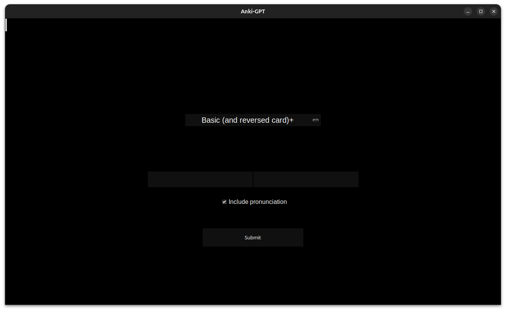
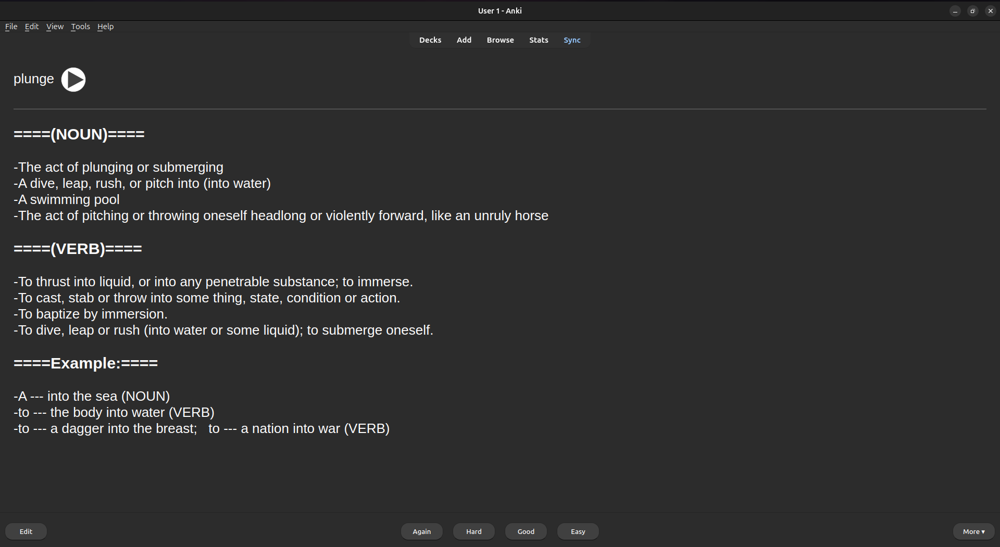
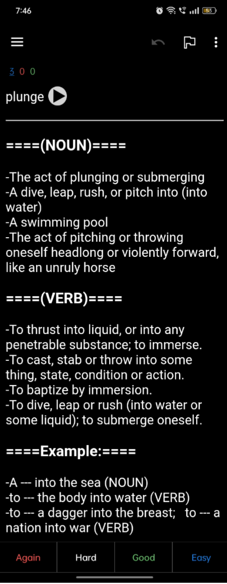

---

# Anki Flashcard Generator

## Overview

A simple tool for creating vocabulary flashcards in Anki. This project is designed for people who want to improve their English vocabulary or expand their word knowledge. For example, when reading a book and encountering an unfamiliar word, you can quickly add it to your flashcards with a definition, example sentences, and optional pronunciation.

---

## Features

* Simple Tkinter-based GUI for entering words.
* Option to include or skip pronunciation.
* Automatically generates flashcards with definitions and example sentences.
* Fetches up to 4 definitions per part of speech for each word.
* Includes 2 example sentences per part of speech for better context
* Supports multiple card types.
* Works with **Anki** through **AnkiConnect**.
* Automatically creates the default deck **"vocabulary-auto"** if it doesn’t already exist.
* Recommendations for a cleaner look: Align flashcard text to **left** in AnkiDroid.
* Future plans: AI-powered features for smarter card generation.

---

## Requirements

* Python 3 (tested on Python 3.12)
* [Anki](https://apps.ankiweb.net/) installed and running.
* [AnkiConnect](https://ankiweb.net/shared/info/2055492159) add-on installed and running.
* pip-installed dependencies:

  ```
  requests>=2.0.0
  ```
* tkinter for GUI (usually included with Python)

---

## Installation

It is recommended to use a Python virtual environment to install dependencies safely. You can create and activate one using python3 -m venv venv and source venv/bin/activate (Linux/macOS) or venv\Scripts\activate (Windows), then run pip install -r requirements.txt.

1. Clone this repository:

   ```bash
   git clone https://github.com/muzammilnt/anki-flashcard-generator.git
   cd anki-flashcard-generator
   ```
2. Install dependencies:

   ```bash
   pip install -r requirements.txt
   ```
3. Open and run the GUI:

   ```bash
   python main.py
   ```
4. Make sure **Anki** and **AnkiConnect** are running.

---

## Usage

1. Launch the app with `python main.py`.
2. Enter a word, select a card type, and choose whether to include pronunciation.
3. Click to generate and send the flashcard to Anki.
4. Cards will appear in the **"vocabulary-auto"** deck.

---

## Screenshots

### GUI Interface




### *Desktop* example card in Anki with text aligned to the left.




### *AnkiDroid* example card in Anki with text aligned to the left.



---

## Notes

* The quality of the flashcards depends on the [free dictionary API](https://dictionaryapi.dev/) provider.
* Requires **Anki** to be running in the background with **AnkiConnect** enabled.

---

## Future Improvements

* AI-powered flashcard generation to provide smarter example sentences and better word context.

---

